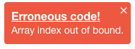

# notifyMe

**notifyMe** is a angular 1.x module which can be used to show notification messages within a SPA. The notifications will be used to display information which give the user a feedback, but do not disturb them at the current work.
The notification will appear on top right side of the screen.


## APIs to consume:
Following are the APIs which you can use in your project after injecting this module in your angular application.

**Notification class**
Notification is a class with following properties.
- `notifId` : Unique id for this notification.
- `type` : Type of notification
- `message` : Notification message
- `title` : Notification title
- `close` : Close function to dismiss the notification
- `options` : Notification options

**Info notification:**
`notifyMe.ofInfo(msg, title, [options(optional)]);`
returns `notificationObj`

**Warning notification:**
`notifyMe.ofWarning(msg, title, [options(optional)]);`
returns `notificationObj`

**Error notification:**
`notifyMe.ofError(msg, title, [options(optional)]);`
returns `notificationObj`

**Clear all notification:**
`notifyMe.clear([notificationObj(optional)]);`


### Building notifyMe

To build notifyMe module, you will need [node](http://nodejs.org) installed.

```
npm install -g gulp
npm install
```
At this point the dependencies have been installed for this module.
- Run the build by `gulp build`
- Run the test by `gulp test`
- Check the docs by running

### Accessing docs for notifyMe
Run
```
gulp buildDocs
gulp runDocs
```
and then open http://localhost:8083 in your browser to access the notifyMe docs generated using ngDocs.

### Follow 3 Easy Steps to use this module.

1. Build the module to generate 2 files in `build` folder named `notify-me.css` and `notifyMe.js`..
```
gulp build
```

2. Include these 2 files in your project after including jquery, angular and angular-animate libraries.
  - Link the CSS file as  `<link href="notify-me.css" rel="stylesheet"/>`
  - Link the JS file as  `<script src="motifyMe.js"></script>`
  - Inject `notifyMe` while creating your angular app as `angular.module('yourApp', ['notifyMe', 'otherDIs'])`. Now you can use the `notifyMe` service throughout your application by injecting the service in your controllers.

3. Use notifyMe apis to display notifications for info, warning or error
    ```js
    // Display an info notification
    notifyMe.ofInfo('Hello world! This is a info notification message.', 'Info notification title');
    ```
    

    ```js
    // Display warning notification
    notifyMe.ofWarning('Warning: Cigarette smoking is injurious to health.', 'Hazardous warning')
    ```
    
    ```
    // Display an error notification
    notifyMe.ofError('Array index out of bound.', 'Erroneous code!')
    ```
    
### Close Button

The cross on top right corner of notification will dismiss the current notification.
This is available in all types of notifications. Customise using `closeable` params in `options` while triggering the notification.

### Auto-dismiss/Timeouts
At present, only `info` notification are dismissed automatically after 90000ms.
This can be customised by overriding the timeout parameter in config file.
This can also be customised using `timeout` and `autoDismiss` params in options while triggering the notifications.
INFO and ERROR notification can also be made autodismissable by setting `autoDismiss` property to `true` in options while creating notification.
   *Note:* Setting `timeout` to 0 with `autoDismiss` to `true` will dismiss the notification automatically.
